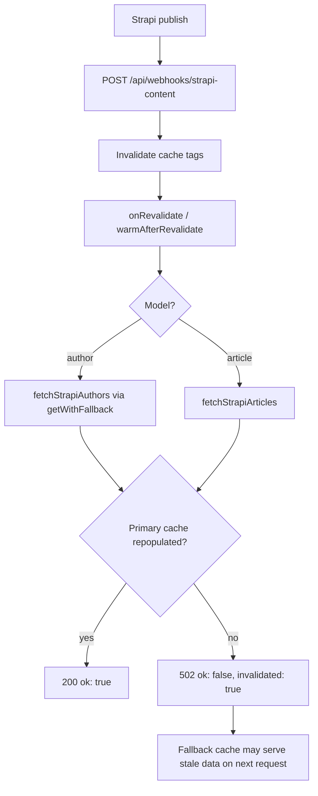

# Bug Audit — datum.net

**Date:** 2026-06-16  
**Last updated:** 2026-06-16  
**Scope:** Full codebase review (API/webhooks, Strapi cache, SSR pages, components, auth, deployment)

## Executive summary

~~The most urgent issue is a **runtime crash in author fetching** (`cache.getWithFallback` missing in `@datum-cloud/strapi-revalidate@0.1.1`).~~ **Resolved** — upgraded to `@datum-cloud/strapi-revalidate@0.2.0`; `getWithFallback()` is implemented and typecheck passes.

~~Remaining top priority: debug string in `BlogItemStrapi.astro` (critical #2) and open-redirect risk (high #9).~~ Critical #2 and high #3 are **resolved** on branch `bugs`. Next top priority: open-redirect risk (high #9). Requires `@datum-cloud/strapi-revalidate@0.3.0` publish before deploy (currently linked locally). ESLint passes. E2E coverage is minimal (homepage only).

---

## Verification evidence

| Check               | Result (initial audit)               | Result (re-check, 2026-06-16) |
| ------------------- | ------------------------------------ | ----------------------------- |
| `npm run typecheck` | **4 errors** — all `getWithFallback` | **0 errors**                  |
| `npm run lint`      | Pass                                 | Pass                          |
| `npm run build`     | **Blocked** by typecheck             | Unblocked (typecheck passes)  |
| E2E tests           | 1 spec (`tests/e2e/home.spec.ts`)    | unchanged                     |
| Installed package   | 0.1.1                                | 0.3.0 (npm pending)           |

---

## Critical

### 1. ~~`cache.getWithFallback()` called but not implemented~~ ✅ RESOLVED

**Status:** Resolved 2026-06-16 — `@datum-cloud/strapi-revalidate` upgraded to **0.2.0**; `CacheManager.getWithFallback()` is implemented. `npm run typecheck` passes with 0 errors.

**Files:** `src/libs/strapi/authors.ts` (lines 228, 267, 290, 316)

**Original problem:** `@datum-cloud/strapi-revalidate@0.1.1` exposed `get`, `getFallback`, `set`, `delete`, `invalidate` — but **not** `getWithFallback`. Calls in `authors.ts` threw `TypeError` on cache miss.

**Resolution:** Reinstall/update dependencies so `node_modules` resolves `^0.2.0` → `0.2.0`. No app code change required; `authors.ts` calls are correct against the new API.

---

### 2. ~~Debug string shipped in production UI~~ ✅ RESOLVED

**Status:** Resolved 2026-06-16 — removed stray `fdas` suffix from `BlogItemStrapi.astro` link `title` attribute.

**File:** `src/components/blog/BlogItemStrapi.astro:15`

**Original problem:**

```astro
title={post.data.title + `fdas`}
```

**Impact:** Every Strapi blog list item showed `"Article Titlefdas"` in tooltips and accessibility text.

**Resolution:** `title={post.data.title}`

---

## High

### 3. ~~Author webhook warm fails silently → 200 OK anyway~~ ✅ RESOLVED

**Status:** Resolved 2026-06-16 — `@datum-cloud/strapi-revalidate@0.3.0` adds `webhook.failOnWarmError` (default `true`); warm failures return **502** with `{ ok: false, invalidated: true }`. datum.net passes `onRevalidate: warmAfterRevalidate` directly to `createWebhookHandler` (post-handler warm workaround removed).

**Files:** `src/pages/api/webhooks/strapi-content.ts`, `@datum-cloud/strapi-revalidate` webhook handler

**Original problem:** Package caught `onRevalidate` errors, logged them, and returned `{ ok: true }`. Strapi timeouts/network errors during warm looked successful to the CMS.

**Resolution:** Package returns 502 on warm failure; datum.net warm logic throws via `assertPrimaryCache()` when primary cache is not repopulated after invalidation.

---

### 4. Windows download redirect uses wrong path

**File:** `src/pages/download/index.astro:10`

Windows UA redirect goes to `/downloads/windows`; canonical routes are `/download/windows`. Linux/macOS correctly use `/download/...`.

**Impact:** 404 in dev/preview or any environment without `server.mjs` redirect rules.

**Fix:** Change to `/download/windows`.

---

### 5. Category pages bypass cache layer entirely

**File:** `src/pages/blog/category/[slug].astro`

Uses legacy `graphql()` directly — no primary cache, no fallback, no webhook tag alignment, no timeout.

**Impact:** Strapi outage → empty response → 404, even when cached blog data exists elsewhere.

**Fix:** Route category queries through cached fetchers in `articles.ts`.

---

### 6. ~~Slug change leaves orphaned per-slug cache entries~~ ✅ PARTIALLY RESOLVED

**Status:** Partially resolved 2026-06-16 in `@datum-cloud/strapi-revalidate@0.3.0` — `mapModelToTags()` now invalidates slug tags for `previousSlug`, `oldSlug`, and `previous_slug` when present on the webhook entry. Strapi must supply a prior slug field (e.g. via lifecycle hook); renames without that field still leave orphaned per-slug cache.

**File:** `strapi-revalidate/src/webhook/tags.ts`

**Original problem:** Tags derived from the **current** slug only. Renaming `old-slug` → `new-slug` never invalidated `article:old-slug`.

**Remaining fix (optional):** Strapi lifecycle to populate `previousSlug` on publish, or prefix invalidation for all `strapi-article-*` keys on any article event.

---

### 7. GraphQL pagination capped at 100

**Files:** `src/libs/strapi/articles.ts`, `authors.ts`, `roadmaps.ts`

Hard `limit: 100` silently drops content beyond the first page. Sitemap uses 500 — inconsistent.

**Fix:** Paginate until empty, or raise limit and align with sitemap.

---

### 8. HTTP cache headers defeat webhook freshness

**File:** `src/pages/blog/[slug].astro:35`

```ts
Astro.response.headers.set('Cache-Control', 'public, max-age=300, stale-while-revalidate=3600');
```

Server-side cache invalidates on webhook, but browsers/CDNs can serve stale HTML for up to 1 hour.

**Fix:** Use shorter `s-maxage`, CDN purge on webhook, or `private, no-cache` for SSR Strapi pages.

---

### 9. Open redirect via unvalidated `redirect_uri`

**Files:**

- `src/pages/api/auth/login.ts:18-19`
- `src/pages/auth/callback.astro:28-33`
- `src/pages/auth/login.astro:12`

`redirect-to` / `redirect_uri` values are stored in cookies and passed to `Astro.redirect()` with no same-origin validation.

**Impact:** Attacker can send victim through OAuth and redirect to `https://evil.com`.

**Fix:** Allow only relative paths matching `/^\/(?!\/)/`, or an allowlist of origins.

---

### 10. Numeric blog slugs collide with pagination

**File:** `src/pages/blog/[slug].astro:39-41`

Purely numeric slugs (e.g. `"2"`) are treated as pagination pages, not articles. An article at `/blog/2` would never render.

**Fix:** Check article existence first, use `/blog/page/2` for pagination, or disallow numeric slugs in CMS.

---

## Medium

| #   | Issue                                                                       | Location                                                                             |
| --- | --------------------------------------------------------------------------- | ------------------------------------------------------------------------------------ |
| 11  | `Astro.redirect('/404')` returns **302**, not 404 — bad for SEO/monitoring  | `blog/[slug].astro`, `authors/[slug].astro`, `download/[slug].astro`, category pages |
| 12  | `JSON.parse(sessionCookie)` uncaught → 500 on malformed cookie              | `src/pages/api/user.ts:43`                                                           |
| 13  | `keyFeatures.map()` without guard — optional field crashes                  | `src/components/features/Grids.astro:25`                                             |
| 14  | Unsanitized HTML via Alpine `x-html` — XSS risk                             | `src/components/events/EventCalendarSection.astro:286`                               |
| 15  | Legacy `graphql()` has no timeout; category pages can hang                  | `src/libs/strapi/index.ts`                                                           |
| 16  | Cache admin APIs scan `.cache/` only — wrong when Redis is primary          | `src/libs/cacheViewer.ts`                                                            |
| 17  | Per-pod file fallback not shared across replicas (2 replicas in deployment) | `src/libs/strapi/_runtime.ts` + `config/base/deployment.yaml`                        |
| 18  | Redis `lazyConnect` with no error handler — unhandled rejections            | `src/libs/strapi/_runtime.ts:86`                                                     |
| 19  | `POST /api/cache/strapi` returns `success: true` with partial failures      | `src/pages/api/cache/strapi.ts`                                                      |
| 20  | Blog copy-URL handler breaks on apostrophes in canonical URL                | `src/pages/blog/[slug].astro:438`                                                    |
| 21  | `_runtime.ts` hard-fails at import when `STRAPI_TOKEN` is missing           | `src/libs/strapi/_runtime.ts:63-76`                                                  |
| 22  | Event "Register" link shown with missing `url`                              | `EventCalendarSection.astro:431-436`                                                 |
| 23  | `Aside.astro` localStorage key is `'undefined'` when `title` is missing     | `src/components/Aside.astro`                                                         |
| 24  | `download/[slug]` missing-slug redirect uses legacy `/downloads/` path      | `src/pages/download/[slug].astro:21`                                                 |

---

## Low / maintenance

- **Duplicate dead branches** in `Icon.astro:43-52` (`close`, `youtube` repeated)
- **`server.mjs`** proxy patterns like `/docs/*` never match (`startsWith` with literal `*`)
- **Webhook test script** (`tests/test-webhook.sh`) missing required `uid` field — tests give false confidence
- **`isValidCachedAuthors`** rejects empty arrays — valid empty CMS never caches (`authors.ts:168-169`)
- **Hidden debug spans** on blog article page (`blog/[slug].astro:447-455`)
- **Career job links** use `target="_blank"` for internal Ashby URLs (`JobList.astro`)
- **Docs vs code mismatch** on webhook headers (`docs/STRAPI_CACHE_API.md` vs `strapi-content.ts`) — package now accepts `X-Webhook-Secret` natively (0.3.0)
- **`cacheApiAuth`** leaks secret length before constant-time compare (`cacheApiAuth.ts`)
- **`FirstSection.astro`** logo cycling with empty columns can hit `% 0` → `NaN` (component unused on current home page)

---

## Architecture: cache + webhook flow



> **Note:** Author path via `getWithFallback()` was broken on 0.1.1 (critical #1); fixed in 0.2.0. Warm failures surfaced as 502 since 0.3.0.

---

## Recommended fix order

1. ~~Fix `authors.ts` cache pattern (unblocks build + webhook warm)~~ ✅ done via `@datum-cloud/strapi-revalidate@0.2.0`
2. ~~Remove `fdas` debug string in `BlogItemStrapi.astro`~~ ✅ done
3. ~~Webhook warm failures return 502~~ ✅ done via `@datum-cloud/strapi-revalidate@0.3.0` + `onRevalidate` in `strapi-content.ts`
4. Fix Windows download path (`/download/windows`)
5. Add redirect URI validation (security)
6. Route category pages through cached fetchers
7. Strapi lifecycle for `previousSlug` on rename (completes #6)
8. Fix 404 redirect semantics across SSR routes

---

## Related docs

- [STRAPI_CACHE_API.md](./STRAPI_CACHE_API.md) — cache admin API and webhook setup
- [PROJECT_STRUCTURE.md](./PROJECT_STRUCTURE.md) — repo layout
