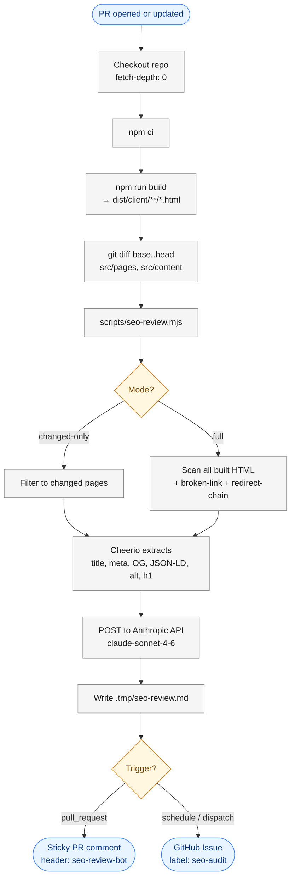
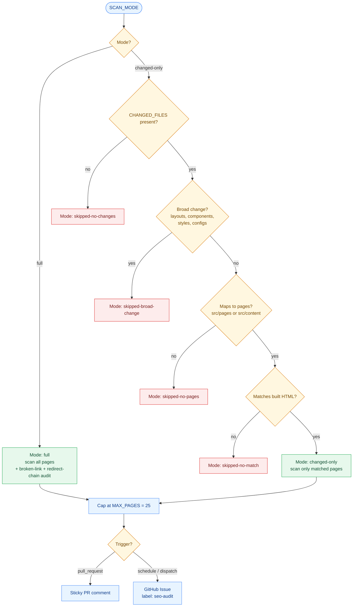

# SEO Review Workflow

Automated SEO and meta-data review with two triggers:

- **PR (changed-only)** — runs on every pull request, scans only the pages affected by the diff, posts a sticky PR comment.
- **Weekly full audit** — cron-scheduled every Monday 06:00 UTC (also manually triggerable via `workflow_dispatch`). Scans every built page, runs broken-link and redirect-chain audits, and opens (or supersedes) a GitHub Issue labelled `seo-audit` instead of commenting on a PR.

- Workflow: [`.github/workflows/seo-review.yml`](../.github/workflows/seo-review.yml)
- Script: [`scripts/seo-review.mjs`](../scripts/seo-review.mjs)
- Config: [`scripts/seo-review.config.json`](../scripts/seo-review.config.json)
- Output: `.tmp/seo-review.md` (git-ignored)

---

## How it works

### Pipeline overview



### Page-selection logic



### 1. Build

The workflow runs `npm run build` so that the same HTML shipped to users is what's analyzed. `dist/client/**/*.html` is the source of truth — not `src/pages`.

### 2. Changed files

`git diff --name-only base..head` is restricted to `src/pages/**` and `src/content/**`. The list is passed to the script via the `CHANGED_FILES` env var (newline-separated).

### 3. Page selection

The script walks `dist/client`, applies the exclusion config, then picks pages based on `SCAN_MODE`:

| Mode reported in output | When                                                                                        |
| ----------------------- | ------------------------------------------------------------------------------------------- |
| `full`                  | `SCAN_MODE=full` — every built page is analyzed, with broken-link and redirect-chain audits |
| `changed-only`          | `SCAN_MODE=changed-only` and the diff maps to built pages                                   |
| `skipped-broad-change`  | A "broad" file changed (layout/component/style/config) — review skipped                     |
| `skipped-no-match`      | Slugs mapped but no built HTML matched — review skipped                                     |
| `skipped-no-pages`      | No `src/pages` or `src/content` files in the diff — review skipped                          |
| `skipped-no-changes`    | `changed-only` mode without `CHANGED_FILES` — review skipped                                |

> A single `SCAN_MODE` env drives behaviour. PR runs set `SCAN_MODE=changed-only` to keep the hot path fast. The weekly cron and `workflow_dispatch` set `SCAN_MODE=full` for site-wide analysis.

Broad-change detector (triggers skip in `changed-only` mode only):

```
src/layouts/**, src/components/**, src/styles/**, src/middleware/**,
astro.config.*, tailwind.config.*, src/consts*, package.json, package-lock.json
```

A hard cap of `MAX_PAGES` (default `25`) keeps the Claude payload bounded.

### 4. Metadata extraction (Cheerio)

For every selected HTML file, the script extracts:

- `<title>` and length
- `<meta name="description">` and length
- `<link rel="canonical">`
- `<meta name="robots">`
- `<html lang>`
- Open Graph: `og:title`, `og:description`, `og:image`, `og:type`
- Twitter: `twitter:card`, `twitter:image`
- `h1` count + first `h1` text
- `` count + count missing `alt`
- JSON-LD presence + `@type` values (`invalid` if JSON parse fails)

### 5. Claude review

The JSON array is sent to the Anthropic Messages API (`claude-sonnet-4-6` by default) with a system prompt that asks for a concise PR comment structured as:

1. **Summary** — overall verdict, worst-issue count
2. **Critical issues** — missing/duplicated title, description, canonical, h1; noindex on prod; title >70 chars; description outside 70–160 chars; missing `og:image`; broken JSON-LD
3. **Improvements** — alt-text gaps, JSON-LD coverage, social tags
4. **Per-page notes** — only pages with issues

### 6. Delivery

- **PR runs** — [`marocchino/sticky-pull-request-comment@v3`](https://github.com/marocchino/sticky-pull-request-comment) posts (or updates) a single comment per PR using the header `seo-review-bot`. Only the Claude-generated review is included; raw metadata is kept out of the comment to stay compact (inspect job logs or rerun locally to see the JSON).
- **Weekly / dispatched runs** — A new GitHub Issue is opened titled `SEO Audit — YYYY-MM-DD` and labelled `seo-audit`. Any older open `seo-audit` issues are auto-closed with a "superseded by" comment so the list stays clean.

### 7. Broken-link and redirect-chain audits (full mode only)

For each scanned page the script collects every relative `<a href="/...">` and every `<meta http-equiv="refresh">` target.

- **Broken links** — internal hrefs whose normalized path is not present in `dist/client` AND has no matching file under `src/pages` (so SSR-rendered routes like `/blog/` are not flagged as broken). Absolute URLs (`https://...`) are skipped — only same-origin relative refs are validated.
- **Redirect chains** — any meta-refresh source whose target also redirects, producing 2+ hops; loops are detected and tagged.

When either list is non-empty, it is appended to the Claude payload, and Claude is asked to call them out as critical issues.

---

## Configuration

### Exclusion config — `scripts/seo-review.config.json`

```json
{
  "excludePaths": ["/dev/build", "/dev", "/preview", "/draft", "/_astro", "/admin", "/fonts"],
  "excludeFiles": ["404.html", "500.html", "error.html", "offline.html", "maintenance.html"],
  "excludeFilePatterns": ["^\\d{3}\\.html$"]
}
```

- `excludePaths` — URL path prefixes; matches `url === p` or `url.startsWith(p + "/")`
- `excludeFiles` — exact basenames
- `excludeFilePatterns` — case-insensitive regex against basename (default catches every 3-digit status page, e.g. `403.html`)

Override the config file location with `SEO_CONFIG=path/to/file.json`.

### Environment variables

| Variable            | Required | Default                          | Purpose                                                                                                                            |
| ------------------- | -------- | -------------------------------- | ---------------------------------------------------------------------------------------------------------------------------------- |
| `ANTHROPIC_API_KEY` | ✅       | —                                | Anthropic API key (CI: repo secret)                                                                                                |
| `ANTHROPIC_MODEL`   |          | `claude-sonnet-4-6`              | Override the model                                                                                                                 |
| `DIST_DIR`          |          | `dist/client`                    | Build output to scan                                                                                                               |
| `MAX_PAGES`         |          | `25`                             | Hard cap on pages sent to Claude                                                                                                   |
| `MAX_INPUT_CHARS`   |          | `640000`                         | Char cap on `user` content (~160K tokens, headroom for 200K Claude limit). If exceeded, the script drops tail pages until it fits. |
| `OUTPUT_FILE`       |          | `.tmp/seo-review.md`             | Path to write the markdown comment                                                                                                 |
| `SEO_CONFIG`        |          | `scripts/seo-review.config.json` | Path to exclusion config                                                                                                           |
| `CHANGED_FILES`     |          | _empty_                          | Newline-separated changed files (workflow injects this on PR runs)                                                                 |
| `SCAN_MODE`         |          | `changed-only`                   | `changed-only` (PR runs) or `full` (weekly audit; adds broken-link + redirect-chain checks)                                        |
| `SITE_URL`          |          | `https://www.datum.net`          | Site origin; only used to recognize same-host absolute URLs                                                                        |

### Repo secret

Add `ANTHROPIC_API_KEY` under **Settings → Secrets and variables → Actions**.

---

## Running locally

```bash
npm run build

# Weekly-style full audit (incl. broken-link & redirect-chain checks)
ANTHROPIC_API_KEY=sk-... SCAN_MODE=full node scripts/seo-review.mjs

# PR-style scan limited to the pages changed in your branch
ANTHROPIC_API_KEY=sk-... \
SCAN_MODE=changed-only \
CHANGED_FILES="$(git diff --name-only main...HEAD -- 'src/pages/**' 'src/content/**')" \
node scripts/seo-review.mjs

# tail the output
cat .tmp/seo-review.md
```

The script logs the selected mode and page count, e.g.:

```
SCAN_MODE=full → mode: full — 92 candidate(s), analyzing 25.
Audits — broken internal links: 0, redirect chains: 0.
User content size: 20527 chars (~5132 tokens), under cap 640000.
Wrote .tmp/seo-review.md (4550 bytes, 25 pages).
```

---

## Maintenance

- **Add an exclusion** — edit `scripts/seo-review.config.json`.
- **Extend extracted signals** — modify `extractMeta()` in `scripts/seo-review.mjs`. The Claude prompt receives whatever fields you emit, so add the field and (optionally) mention it in the system prompt.
- **Change review tone / structure** — edit the `system` string in `callClaude()`.
- **Bump the model** — set `ANTHROPIC_MODEL` env in the workflow.
- **Change weekly cadence** — edit the `cron:` expression in `.github/workflows/seo-review.yml` (default `0 6 * * 1` = Monday 06:00 UTC).
- **Run an audit on demand** — Actions → _SEO Review_ → _Run workflow_, pick `full` (default) or `changed-only`.
- **Disable on a PR** — temporarily skip by closing/reopening with `paths-ignore` matching, or remove `ANTHROPIC_API_KEY` (the step will fail and the comment won't be posted).
- **Reduce broken-link noise** — absolute `https://` links are skipped by design. If a relative path resolves at runtime (proxy, edge rewrite, etc.), add a stub `src/pages/<path>.astro` or change the link to absolute so the audit treats it as external.

---

## Troubleshooting

| Symptom                                                        | Likely cause / fix                                                                                           |
| -------------------------------------------------------------- | ------------------------------------------------------------------------------------------------------------ |
| Step fails with `ANTHROPIC_API_KEY is not set`                 | Repo secret missing, or running locally without exporting it                                                 |
| `Build dir not found: dist/client`                             | `npm run build` was skipped or failed; check earlier step logs                                               |
| PR comment says `skipped-broad-change`                         | Diff includes a layout/component/style/config file. Trigger `workflow_dispatch` with `full` for a one-off.   |
| Mode `skipped-no-match`                                        | Page renamed/moved, or content collection slug differs from filename — confirm against `dist/client/**`      |
| Excluded page still appears                                    | Exclusion lives at walk time; verify config file path and JSON is valid                                      |
| PR comment not appearing                                       | `permissions: pull-requests: write` missing, or job failed before sticky step                                |
| Weekly Issue not opening                                       | `permissions: issues: write` missing, `GITHUB_TOKEN` lacks scope, or schedule trigger disabled in repo       |
| Broken-link audit reports SSR routes (e.g. `/blog/`) as broken | The route exists under `src/pages` but the script missed it — check matcher, or move route under `src/pages` |
| Claude returns 429 / 529                                       | Rate-limited or overloaded — rerun the job                                                                   |
