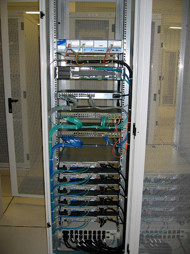
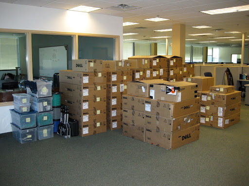

import Figure from '@components/Figure.astro';

On June 12, 2008, I had cuts on my fingers from cage nuts, the local pubs had closed for the night, and I was exhausted from a long day racking, stacking, and cabling at the Equinix AM2 datacenter in Amsterdam, Netherlands. We were proud of our work: a perfect rack layout, swirls of cabling designed to eliminate stress on connectors, and plenty of room for future expansion. This point of presence (POP) would be one of 15x deployed to build the DynECT Managed DNS global network.

In my role as co-founder and CTO at Dynamic Network Services ([DynDNS.org](http://DynDNS.org)), I was sometimes able to get out into the field to help deploy new infrastructure. Getting into the datacenter is a chance to connect a virtual world to the physical world - concrete floors, tilt up slabs, plumbing, power, cooling, and of course, fiber optics. For me, that time in the datacenter is a welcome relief from the desk jockeying that precedes in bringing a new POP online.

<Figure title="DynECT Managed DNS deployment at Equinix AM2; June 2008"></Figure>

As experienced infrastructure operators can attest, racking, stacking, and cabling a POP is often the culmination of many months of effort - there is a ton of work that starts long before anyone can get past the datacenter’s guard desk. There are so many tasks to get done before a piece of gear can ever land in a POP:
- Site Selection: Where, why, and how will you deploy?
- Physical Site Evaluation: Physical Security, Building and Power Systems Resilience
- Connectivity: Fiber, Transport, Transit, Fabrics, Peering Exchanges, Out of Band
- Certifications: SOC-2 Type 2, ISO27001, PCI DSS, HIPAA, etc
- Master Service Agreements, Statements of Work, Service Level Agreements, etc.
- Hardware Procurement, Shipping, Importation, Logistics, and Insurance
- Datacenter Procedures: Physical Access, Ordering Cross Connects, Accessing Remote Hands

<Figure title="DynDNS Offices, DynECT Managed DNS Newark NJ Core POP - Staged for Shipment by Van; February 2009" align="right"></Figure>

These steps, this toil, this paperwork - well, it is commonly months of effort to complete. Master Service Agreement negotiations often involve representatives from technical, business, legal, and procurement teams. Evaluation of a connectivity partner requires technical due diligence, network surveillance, and proof of concept deployments. Shipping equipment across international borders requires new business entities for importation, payment of duties, and tax management strategies. For worldwide networks like DynECT, this isn’t “just a rack of gear” - it is a massive commitment in capital expenditures and future operating expenditures.

Racking and stacking the gear is only one part of the puzzle. That was the part we figured out how to turn into a mini factory assembly line. When you are building a globally anycast IPv4 / IPv6 dual stack network, there are dozens, if not hundreds, of small one off tasks that need to be performed:

- Autonomous System Number (ASN) acquisition from a Regional Internet Registry (RIR)
- IPv4 Address Space acquisition from one or more RIRs.
- IPv6 Address Space acquisition from one or more RIRs.
- Internet Routing Registry (IRRdb) database entries.
- IP Address Geolocation Updates in a dozen or so various registries
- RPKI ROA setup and deployment (Not in 2008, but certainly in 2025)
- Domain Registration and Nameserver Glue Record Creation

The list goes on and on and on. Every time a global network is deployed, someone is doing this work.

Last I checked, there was no Ansible Playbook for setting up BGP RPKI ROAs at an RIR. There is no Terraform script for generating IRRdb records. And there is no Kubernetes Operator for managing Nameserver Glue Records. _Or is there - hint hint hint?_

Let’s fast forward this story to December 2024 — when my phone buzzed with a call from a longtime friend, Alex Benik from Encoded VC. Alex is the kind of person who doesn’t call just to chat. His calls come with a gravitational pull — if he’s dialing, something interesting is happening somewhere on Earth.

“Tom,” he said, after the usual two-second pleasantries, “you’re not going to believe what Zac and Jacob Smith are up to.”

Now, I’ve known Zac and Jacob for almost as long as I’ve known what a cage nut is. The brothers behind Packet (later acquired by Equinix) have always had a unique trait: the uncanny ability to look at a deeply unglamorous infrastructure problem and somehow turn it into a party everyone wants to attend. “More in the tent,” as Jacob would say.

Alex continued. “They’re building something new. And… well… it’s exactly the kind of thing you’ve been doing on repeat for about twenty years.”

I paused. “Which part? The RIR paperwork? IP geolocation purgatory? IRRdbs that still feel like they’re running on email templates? Or the fact that deploying a global network still feels like assembling Ikea furniture from memory while blindfolded in a freezing data hall?”

“Exactly,” he said. “All of it. You know, the work no one brags about on LinkedIn. Except maybe you.”

This is the work you _absolutely must do_ if you want your packets to reach their destinations, and your customers to think your network just “magically” works.

Alex went on:

“They’re calling it… well, they’re still deciding. But imagine if all the things you listed — the RIR tickets, the ROAs, the IRR entries, the IPAM, the glue records, the compliance artifacts, the datacenter onboarding forms — imagine if that all became programmatic. Declarative. Automated. Version-controlled.”

“And cross-cloud?” I asked.

“Cross-cloud, cross-colo, cross-everything.”

> There is an astonishing amount of manual, repetitive, institutional tribal knowledge that sits beneath every modern distributed system. A web of fragile and undocumented playbook of steps that every engineer inherits and quietly re-implements for the hundredth time.

Hearing Alex describe Zac and Jacob’s new venture felt like someone saying, “Hey, you know that burden you’ve been carrying your entire career? The one you assumed was part of the deal? Yeah… you can put it down now.”

And that’s where the story picks up — the collision between two decades of muscle memory and a new idea that infrastructure deployment doesn’t have to feel like a pilgrimage with a screwdriver and a stack of NDAs.

For reference, Amazon EC2 became Generally Available in 2008. Amazon has done this work too. And so has Google Cloud, Oracle, Verisign, UltraDNS, ISC, Packet Clearing House, and every other major cloud provider, bare metal provider, DNS host, and content delivery network (CDN) - _yeah, I built one of those too -_ did the same work_._

Even as virtual machines became APIs and entire data centers dissolved behind glossy cloud consoles, this part of the job never actually changed. The servers moved, the buttons moved, but the bureaucracy and the tribal knowledge stayed stubbornly physical. And so did the network.

No one does this toil-filled (paper) work anymore, but here is the big trade off - as developers and engineers, we are constantly being abstracted away from driving the network like the super power tool it is! The network, as we’ve seen, is often the moat.

The Cloud changed the game. We got a new level of abstraction with robust APIs that automated many elements of the infrastructure layer. New tooling and patterns have evolved to help developers manage infrastructure like they manage code - with semantic versioning, idempotent runbooks, and even AI assisted CLIs. But again, the network is often guarded, protected, and cordoned off from your enjoyment.

Clouds automated everything except the connective tissue that binds systems together. We gained infinite compute, ephemeral storage, GitOps, and AI-assisted CLIs — yet the networking fundamentals remained locked behind vendor portals, NDAs, and tribal knowledge.

The world of AI will rely on networks like we’ve never seen before. When connectivity is a barrier, or abstracted away from maximum leverage, innovation slows. No one has time for this anymore. In reality, less and less people know how to execute these awkward, arcane, and legacy steps in our industry.

Datum is working to take these complex, long-lived, learned experiences of network operators and developers into a systematic platform driven by the modern Kubernetes ecosystem.

- Want a front door for your website or ecommerce shop?
- Need to create secure app to app connections among or between clouds?
- Want a logical VLAN or physical cross connect so you can move your data efficiently?
- Want to enjoy these capabilities but with full control over the network riding underneath it?

Datum’s goal is simple: take the messy, arcane playbooks of Internet infrastructure and turn them into programmable, declarative, repeatable primitives — the same way Kubernetes did for distributed compute - but for networks. Datum distills years of toil and experience in Internet engineering so everyone in the AI generation can enjoy the feeling of running on a powerful network they fully control.

<Figure title="Domains as a Datum K8s Resource Definition, November 2025" align="left"></Figure>

Datum isn’t going at this effort alone. Datum has recruited a powerful community of modern infrastructure providers to power their network. These infrastructure providers are best in class at hosting, advanced BGP routing, and transit connectivity. They have exposed APIs to automate provisioning, configuration management, and deployment. Datum is layering on those stacks to deliver the “networking creature comforts” that we’ve all missed when operating in the Cloud.

Datum turned up AS33438 in less than 60 days in 12 cities globally while performing the tedious steps above — the same steps that used to take quarters of planning and operators with decades of scars. And now it's automated, routine, and repeatable. And available to everyone “in the tent” by API.

At DynDNS, we knew what we were building: core Internet infrastructure (compute, storage, and network) that just could not go down. We enjoyed direct and hands-on access to the network that allowed us to deliver a superior product offering. We had our networking superpowers in hand.

At Datum, the team has a vision to bring these networking superpowers to the next wave of builders. No networking team required.
