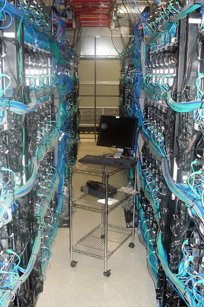

_Ninety days._

That’s how long it took us to stand up a global network for Datum this past summer. IP space, Anycast, DNS, routing policies, traffic engineering, observability—all of it. In just a few months, we had a purpose-built infrastructure running across providers like NetActuate and Vultr, delivering the kind of control and visibility usually reserved for established giants.

Of course, this is literally what I’ve done as my job for 25 years, so I’ve got an edge on most folks. Plus, I had the help of Tom Daly (one of the foremost network builders in the world), the daily support of Josh Reese and Scot Wells (StackPath, SoftLayer alums) and friends in all the right places on speed dial (or Slack connect, as it were).

To put it another way: I had all the advantages, knew exactly what to do, and it took me months. Just so I could show up on the internet at a basic level. Granted, when I helped build networks at Packet and Voxel, it took years to reach the same level of maturity, so there is a bit of progress. 

 _The world has changed a lot since I snapped this picture of a Voxel deployment in the early 2000’s, but under the hood it’s pretty much the same._

## The “deploy everywhere” era
In most every way, deploying and managing infrastructure is a solved problem. Between the cloud native revolution, the maturation of DevOps, and the long march of open source, it’s standard territory to do what Supabase says on their website: build in a weekend, scale to millions. 

Take a look around and Supabase isn’t alone in promising a seamless, scalable experience for every builder:
* Vercel: “Building and deploying should be as easy as a single tap.”
* Railway: “Shipping great products is hard. Scaling infrastructure is easy.”
* Render: “Your fastest path to production.”
* Modal: “AI infrastructure that developers love.”

Unfortunately, as my recent 90-day adventure proved, it’s a radically different story when it comes to innovating on the foundations of the internet: authoritative DNS, distributed edge proxies, global backbone connectivity, deterministic routing, cloud on-ramps, and private connections to key partners. This stuff takes time and commitment even if you know how to do it. And most folks can’t turn to the likes of Tom Daly, Dave Tempkin, Adam Rothschild, Luca Salvatore, Tim Jackson (IFKYK), or the few hundred other folks in the world who have done it at scale. 

Datum is working to close the gap. Our goal is to make what took me months or years to be possible in minutes for the next generation of builders. And to do it without requiring them to be networking experts.

## Why this, and why now?
As an internet infrastructure geek, of course I think every person needs access to their own global backbone and to experience the smooth, velvety performance (and guaranteed MTU!) of an Equinix direct interconnect to AWS US-east. Why should such powerful capabilities be the playground of tech giants and established corporations alone? 

Beyond the issue of democratization and the inherent innovation that comes with more fingers on keyboards, this stuff is actually becoming way more important alongside a reduction in access.

That’s why the basics of a private network matter more than ever:
* **Controlling your own IP space**: It’s more than a technical checkbox. It’s how you own your identity, route your traffic, move between providers and avoid being abstracted away by others.
* **Taking traffic off the public internet**: Privacy, latency, and security all get better when you control the pipes and who you shuttle traffic to or accept it from.
* **Full observability**: You can’t optimize what you can’t see. Alt Clouds need deep, real-time insight into network behavior from the edge of the network to the back of the app.
* **Deterministic routing**: When you can program your traffic paths, you unlock performance, reliability, and user trust.
* **Private interconnects**: Direct, secure connections with partners and platforms can define the difference between good and great service.

The good news? It doesn’t have to be hard. Datum is working to normalize the diverse and messy landscape of connectivity in a multi-cloud, multi-SaaS, data heavy world. We’re turning Internet scale connectivity into something modern builders can plug into programmatically—like infrastructure as code, but for the global internet.

We’re unlocking the same superpowers the big guys use today for thousands of new clouds, millions of builders, and billions of agents.