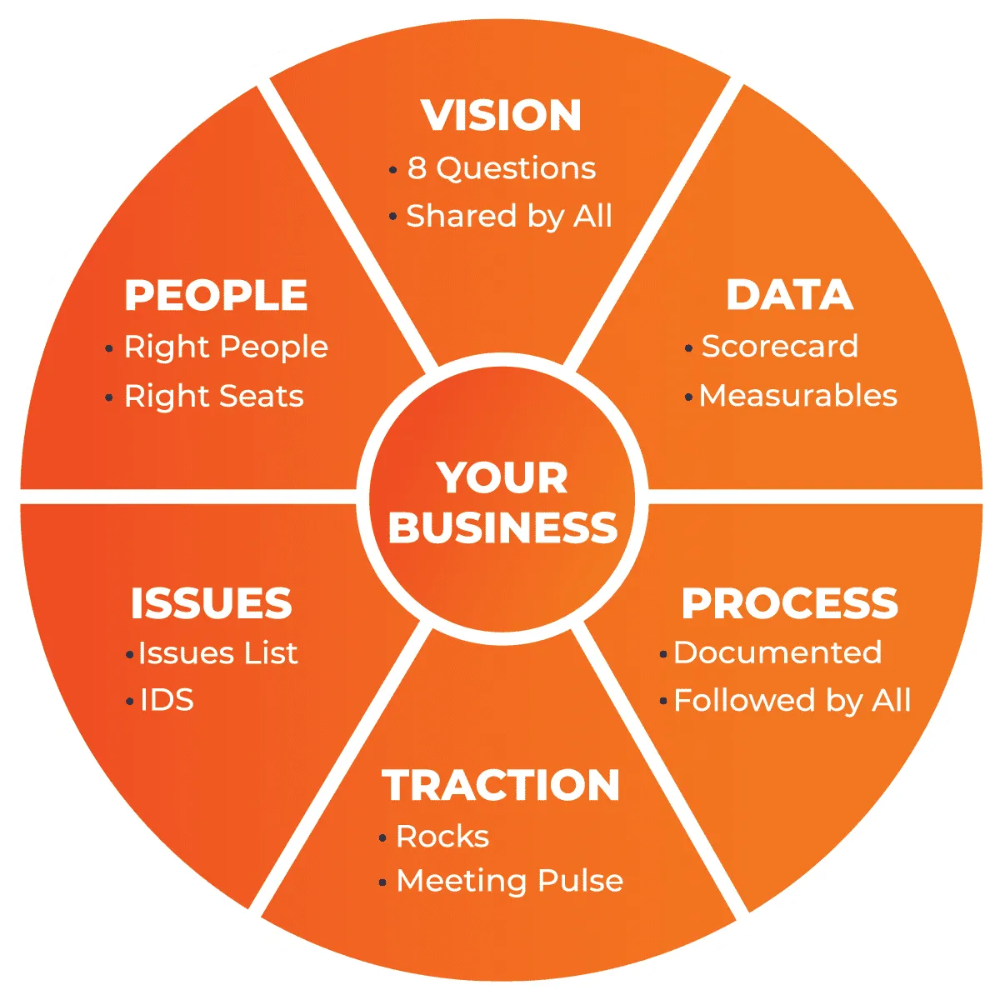

import Figure from '@components/Figure.astro';

EOS is a system that was introduced to our co-founders (Zac and Jacob Smith) over a decade ago by a close friend and business advisor, Steve Smolinsky.

The magic of EOS is that it focuses on simplifying everything, writing those things down so everyone is on the same page, and maintaining a rhythm. No easy feat in a startup (or any business) but very impactful.

The core elements of EOS (the “toolset”) sound simple when you have them in place. In fact, the output of each element fits on a single page! This simplicity is hard-won. As the old saying goes “I didn’t have time to write you a short note, so I wrote you a long one instead!”

<Figure title="Credit: EOS Worldwide https://www.eosworldwide.com/" align="center"></Figure>
