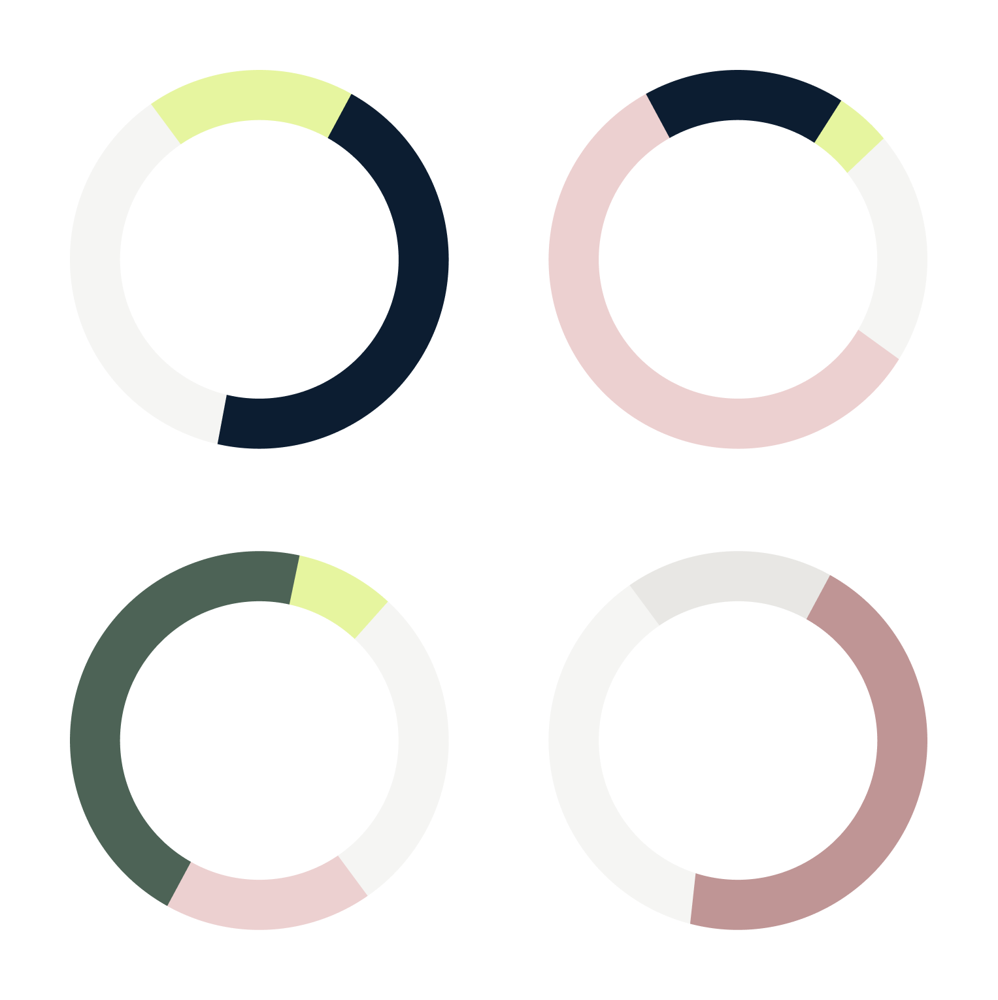

import Container from '@components/Container.astro';
import BrandCardImage from '@components/brand/BrandCardImage.astro';
import ColorPalette from '@components/brand/ColorPalette.astro';
import Button from '@components/Button.astro';

## Core Palette

The Datum core colour palette was chosen to evoke a certain technological adventurism, combined with a grounded maturity that instills confidence.

<Container class="max-w-none brand-card-pad mb-8 md:mb-12 brand-card-pad space-y-12">
  <BrandCardImage>
    
  </BrandCardImage>

  <ColorPalette />
</Container>

## Color Weighting

Datum colors can be used in a variety of configurations, often being used as pairs for maximum impact.

<Container class="brand-card-pad max-w-none">
<BrandCardImage>
  
</BrandCardImage>
</Container>
