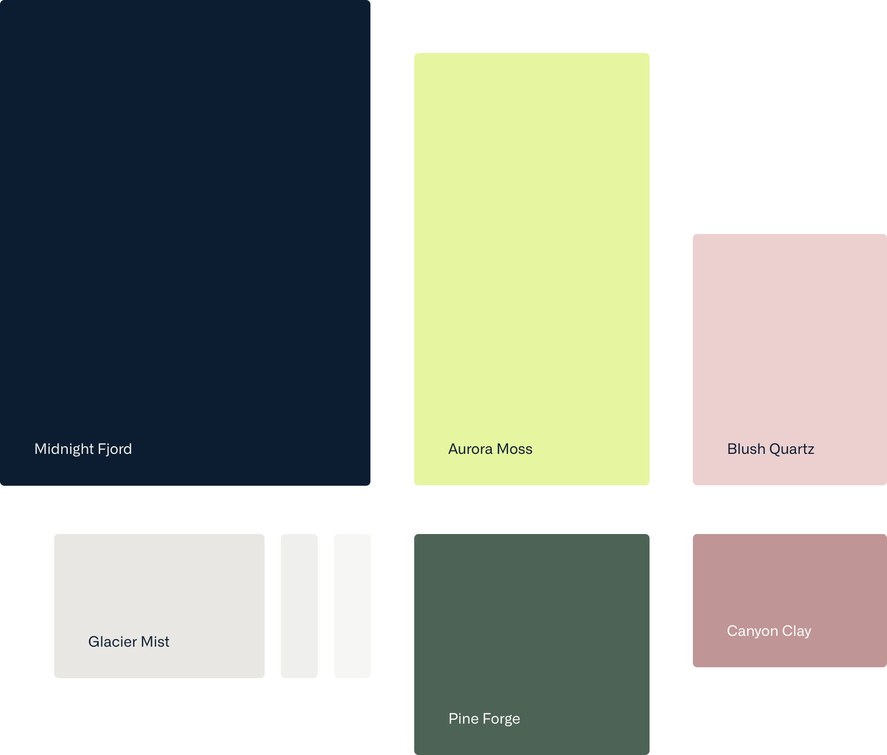

import Container from '@components/Container.astro';
import BrandCardImage from '@components/brand/BrandCardImage.astro';
import ColorPalette from '@components/brand/ColorPalette.astro';
import Button from '@components/Button.astro';

## Core Palette

The Datum core colour palette was chosen to evoke a certain technological adventurism, combined with a grounded maturity that instills confidence.

<BrandCardImage>
  
</BrandCardImage>

<Container class="max-w-none lg:mt-16 md:mt-12 mt-8 brand-content">
  <ColorPalette />
</Container>
