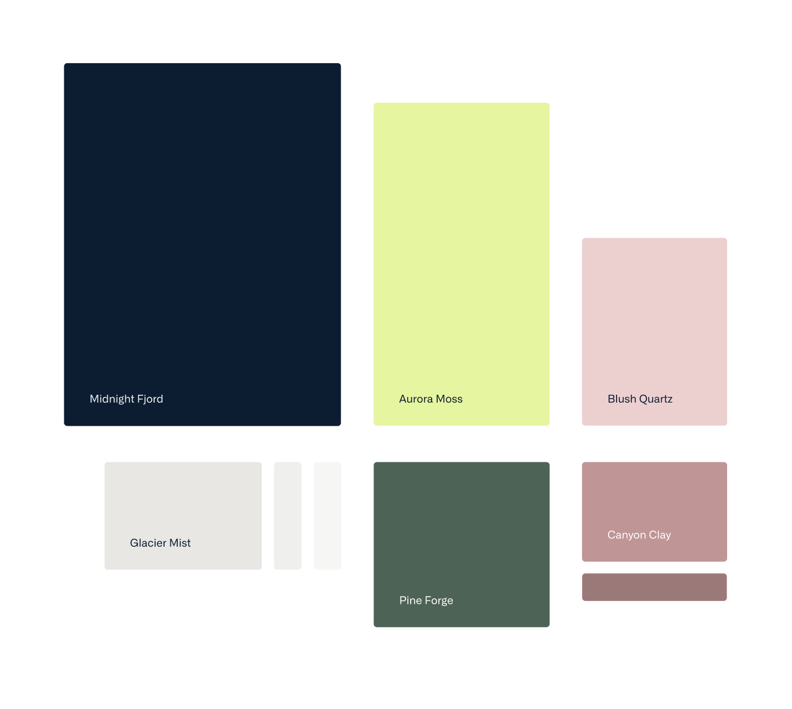
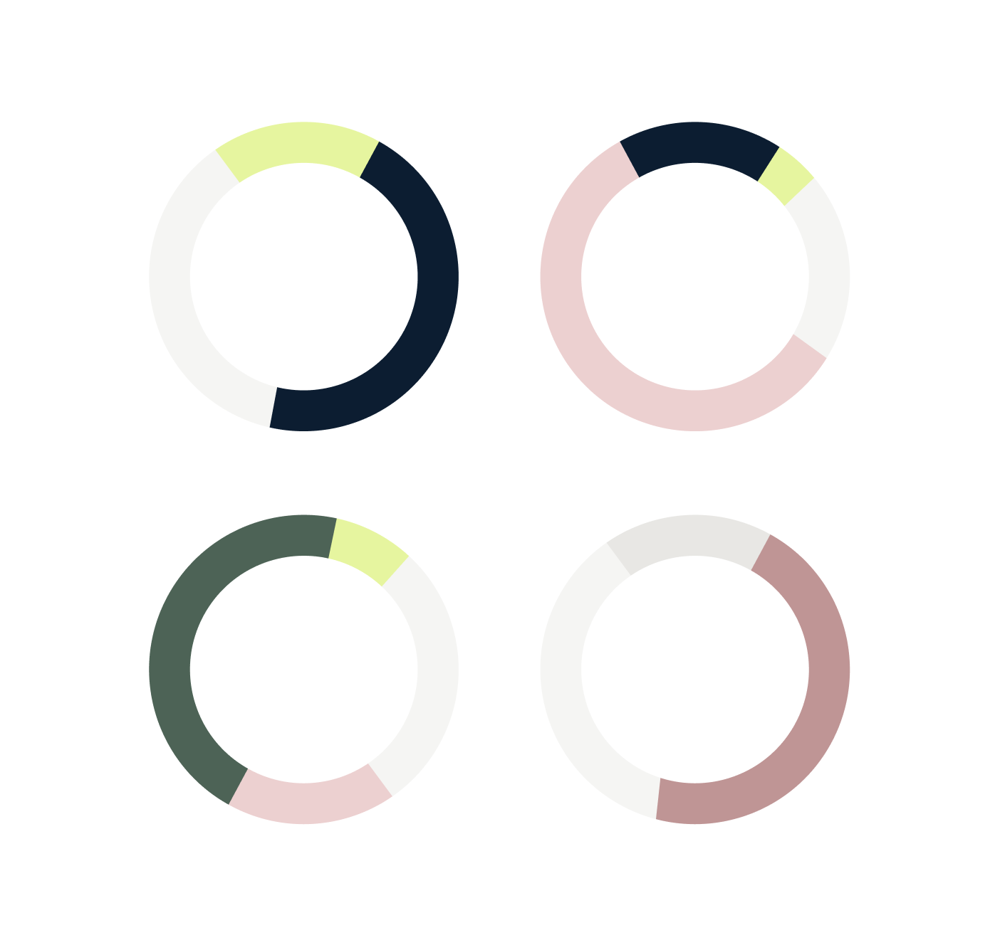

import Container from '@components/Container.astro';
import BrandCardImage from '@components/brand/BrandCardImage.astro';
import ColorPalette from '@components/brand/ColorPalette.astro';
import UtilityPalette from '@components/brand/UtilityPalette.astro';
import Button from '@components/Button.astro';

## Core Palette

The Datum core color palette was chosen to evoke a certain technological adventurism, combined with a grounded maturity that instills confidence.

<Container class="max-w-none brand-card-pad mb-8 md:mb-12 brand-card-pad space-y-12">
  <BrandCardImage>
    
  </BrandCardImage>

  <ColorPalette variant="core" />
</Container>

## Color Weighting

Our colors are most effective when used with a clear sense of hierarchy. Choose one color to lead the composition, supported by one or two contrasting accents. Avoid giving every color equal weight, as this can reduce clarity and visual impact.

<Container class="brand-card-pad max-w-none mb-8 md:mb-12">
<BrandCardImage>
  
</BrandCardImage>
</Container>

## Secondary Palette

The secondary palette extends our core colors and provides additional flexibility when more variety is needed. Use these colors selectively for supporting graphics, illustrations, and content themes, rather than as a replacement for the core palette.

<Container class="max-w-none brand-card-pad mb-8 md:mb-12">
  <ColorPalette variant="secondary" />
</Container>

## Utility Palette

The utility palette communicates status and feedback across all digital touchpoints. These colors have specific functional meanings and should be used consistently for states such as success, warning, error, information, and usage notes.

<Container class="max-w-none brand-card-pad">
  <UtilityPalette />
</Container>
