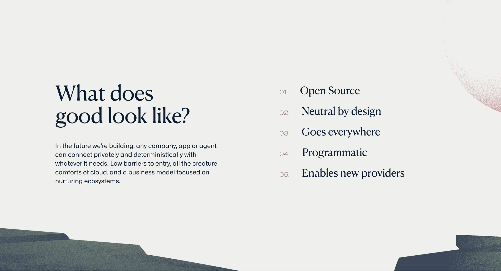

import Container from '@components/Container.astro';
import BrandCardImage from '@components/brand/BrandCardImage.astro';

Examples of how the Datum Design Language can be used, from user experiences to presentations.

<Container tag="section" class="space-y-12 max-w-none lg:mt-16 md:mt-12 mt-8">

<BrandCardImage>
  
</BrandCardImage>

<BrandCardImage>
  
</BrandCardImage>

<BrandCardImage>
  
</BrandCardImage>

<BrandCardImage>
  
</BrandCardImage>

<BrandCardImage>
  
</BrandCardImage>

<BrandCardImage>
  
</BrandCardImage>

<BrandCardImage>
  
</BrandCardImage>

<BrandCardImage>
  
</BrandCardImage>

</Container>
