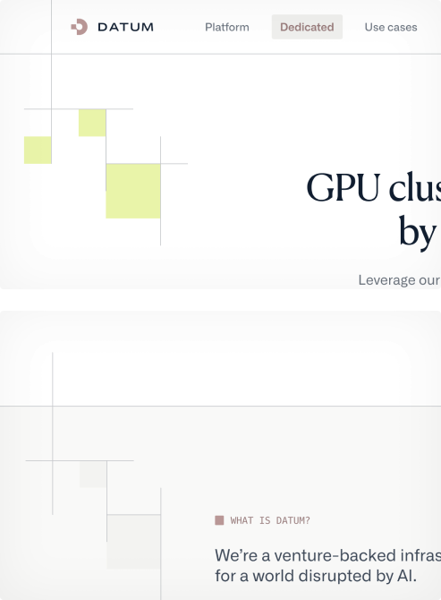
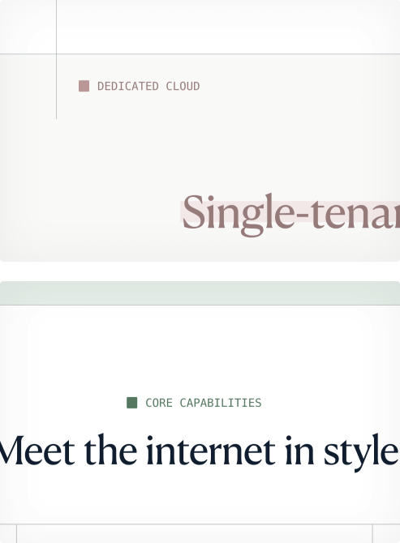
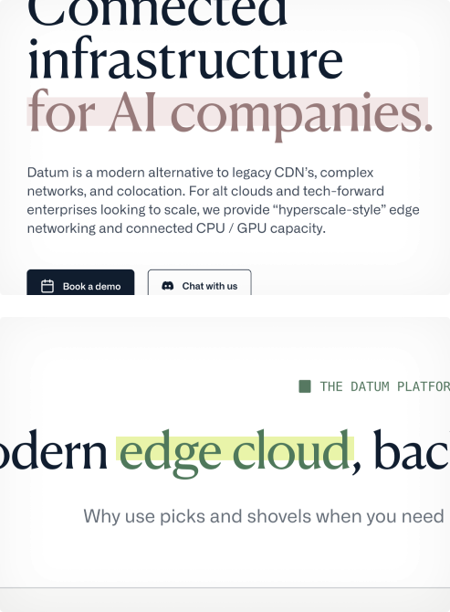
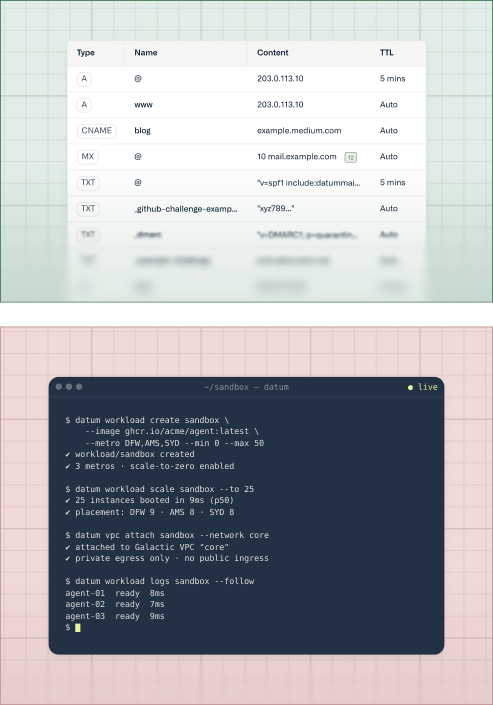
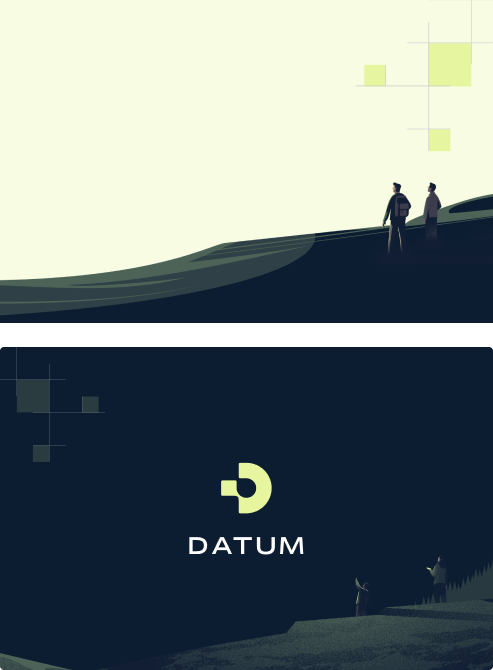
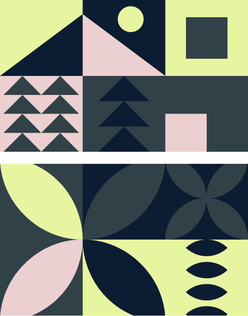

import Container from '@components/Container.astro';
import GraphicItem from '@components/brand/GraphicItem.astro';

## Grid motif

The grid motif visualizes our connected infrastructure. Fine lines evoke the networks linking locations, systems, and services, while solid squares suggest individual points of data moving between them. Arranged in different formations, these elements reflect the adaptable paths through which data is delivered around the world.

<Container tag="section" class="max-w-none brand-card-pad mb-8 md:mb-12">
<GraphicItem>
  <Fragment slot="image">
    
  </Fragment>
  We use the motif to frame or highlight important content, connect page sections, and create a sense of movement through a layout. It can also appear more subtly as a background detail, adding structure and continuity across the brand.
</GraphicItem>
</Container>

## Eyebrow

The eyebrow introduces and categorizes new sections of content. Its monospaced type and typing animation draw inspiration from the command line, giving it a distinctly technical character. The solid square represents a datum—a single point of data and the starting point for something larger.

<Container tag="section" class="max-w-none brand-card-pad mb-8 md:mb-12">
<GraphicItem>
  <Fragment slot="image">
    
  </Fragment>
  Eyebrows can use different brand colors to distinguish between content types or themes. They can be positioned to suit the surrounding layout, typically aligning with the left edge or center of the title content beneath.
</GraphicItem>
</Container>

## Headline highlight

The headline highlight draws attention to important words or phrases, helping key ideas stand out at a glance. Its slightly offset background creates a distinctive, expressive detail without obscuring the letterforms or interrupting the full headline. It brings energy and visual interest to otherwise minimal layouts.

<Container tag="section" class="max-w-none brand-card-pad mb-8 md:mb-12">
<GraphicItem>
  <Fragment slot="image">
    
  </Fragment>
  Highlights can use different brand colors to complement the surrounding content. Text and background colors should come from the same tonal family while maintaining enough contrast for the highlighted words to remain clearly legible.
</GraphicItem>
</Container>

## Showcase images

Showcase images bring our products and features to life through focused views of the interface. Each composition highlights the detail most relevant to the surrounding content, while animated sequences can be used to explain more complex interactions or journeys.

The background grid connects these images to our wider visual system, reinforcing the relationship between individual features and Datum's connected infrastructure.

<Container tag="section" class="max-w-none brand-card-pad mb-8 md:mb-12">
<GraphicItem>
  <Fragment slot="image">
    
  </Fragment>
  The grid can use different brand colors to distinguish between products, features, or content themes. Subtle gradients add depth and help frame the interface, while a soft blur at the bottom suggests that the product continues beyond the visible area.

  These effects should support the interface rather than compete with it, keeping the product itself as the main focus.
</GraphicItem>
</Container>

## Brand Illustrations

Our brand illustrations bring warmth, imagination, and a sense of adventure to Datum. Expansive landscapes and small human figures evoke exploration, representing the ambitious people and organizations building a better way forward.

We use illustrations selectively—typically at the end of a page or within standalone brand content—to preserve their atmosphere, intrigue, and impact.

<Container tag="section" class="max-w-none brand-card-pad mb-8 md:mb-12">
<GraphicItem>
  <Fragment slot="image">
    
  </Fragment>
  Illustrations are often combined with the grid motif, connecting their imagined landscapes with Datum's infrastructure. Compositions should remain simple and spacious, with characters kept intentionally small so that the surrounding message or logo remains the main focus.
</GraphicItem>
</Container>

## Blog illustrations

Our blog illustrations give each story a distinctive visual identity and create a sense of intrigue before the reader begins. Bold geometric forms and recognizable brand colors help Datum content stand out across our website, social channels, and other shared contexts.

<Container tag="section" class="max-w-none brand-card-pad">
<GraphicItem>
  <Fragment slot="image">
    
  </Fragment>
  Our blog illustration library continues to grow as new stories and themes emerge. Choose an image that reflects the central subject or idea of the article, using visual association rather than trying to represent its content too literally.
</GraphicItem>
</Container>
