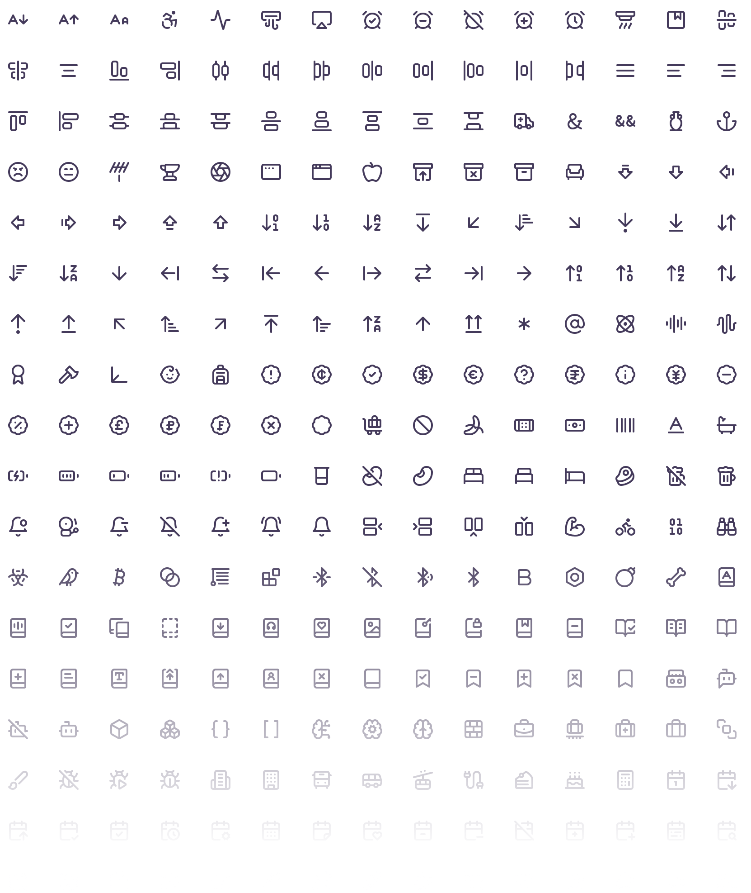

import Container from '@components/Container.astro';
import BrandCardImage from '@components/brand/BrandCardImage.astro';
import Button from '@components/Button.astro';

## Library

We use the Lucide icon library in our digital experiences, an Open Source collection of lightweight, highly optimized, scalable vector symbols with package support, that have an appropriately friendly yet precise tone.

<Container tag="section" class="space-y-12 max-w-none brand-card-pad">
<BrandCardImage>
  
</BrandCardImage>

<Button
class="btn btn--alpha"
text="Access the library"
target="_blank"
href="https://lucide.dev/"
/>
</Container>
