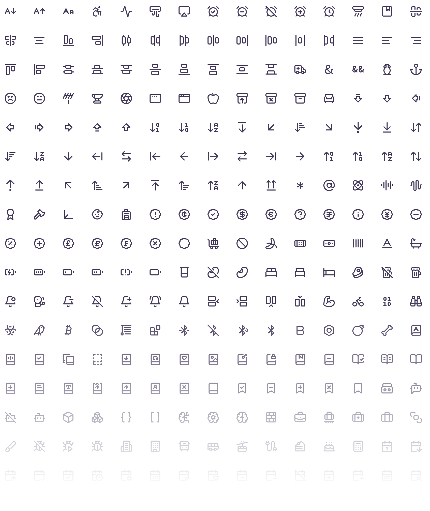

import Container from '@components/Container.astro';
import BrandCardImage from '@components/brand/BrandCardImage.astro';
import Button from '@components/Button.astro';
import ColorPalette from '@components/brand/ColorPalette.astro';

## Icon Library

We use Lucide icons across our digital experiences. Its lightweight, open-source symbols combine a friendly, approachable character with the clarity and precision expected of a technical product. A shared library also helps us communicate actions and ideas consistently across the Datum website and product.

<Container tag="section" class="space-y-12 max-w-none brand-card-pad mb-8 md:mb-12">
<BrandCardImage>
  
</BrandCardImage>

<Button
class="btn btn--alpha"
text="Access the library"
target="_blank"
href="https://lucide.dev/"
/>
</Container>

## Color Guidance

Icons should use Midnight Fjord, Canyon Clay, or White in most situations, selecting the option that provides the clearest contrast against the background. Within a featured product category—Deliver, Build, or Connect—icons can use the corresponding tonal color to connect them with the surrounding content.

<Container class="max-w-none brand-card-pad mb-8 md:mb-12">
  <ColorPalette variant="icon-guidance" class="compact" />
</Container>

## Size and Stroke Width Guidance

Consistent sizing and stroke widths help icons remain clear and balanced alongside text and interface elements. On the website, icons are typically displayed at 20px with a 1.75px stroke. Within the product, use 16px icons with a 1px stroke.

<Container class="max-w-none brand-card-pad">
  

| Digital Experience | Size | Stroke Width |
| ------------------- | ---- | ------------ |
| Website | 20px | 1.75px |
| Product | 16px | 1px |

  

</Container>
