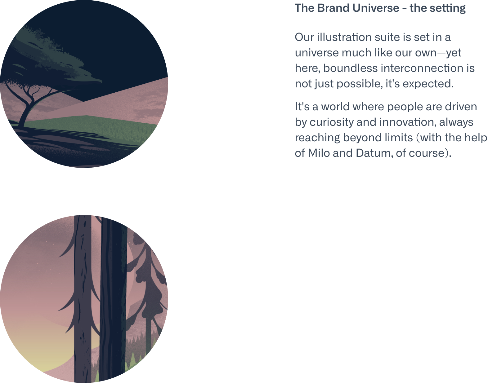

import Container from '@components/Container.astro';
import BrandCardImage from '@components/brand/BrandCardImage.astro';
import Button from '@components/Button.astro';

A cornerstone of our brand identity are our illustrated brand characters - Milo and The Team, and the brand universe they live in. They give our user experiences a unique tone, one that encourages and guides exploration.

<Container tag="section" class="space-y-12 max-w-none lg:mt-16 md:mt-12 mt-8">

<BrandCardImage>
  
</BrandCardImage>

<BrandCardImage>
  
</BrandCardImage>

<BrandCardImage>
  
</BrandCardImage>

<BrandCardImage>
  
</BrandCardImage>

<Button
class="btn btn--glacier-mist-700 btn--large"
text="Download The Illustration Suite"
target="_blank"
href="https://drive.google.com/drive/folders/1sUKPvndRfS_b08FTyhXLy3QYTQtaxaor?usp=drive_link"
/>

</Container>
