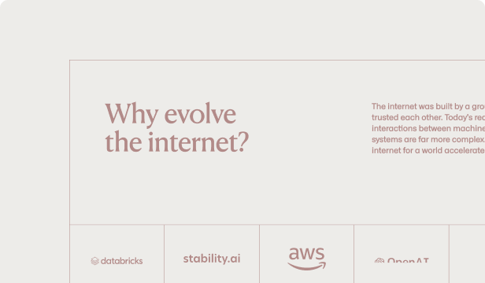

import Container from '@components/Container.astro';
import BrandCard from '@components/brand/BrandCard.astro';

A foundational, hyperscale-ready framework that guides the design of all user experiences within the Datum ecosystem.

<Container tag="section" class="grid gap-7.5 md:grid-cols-2 lg:grid-cols-3 max-w-none lg:mt-16 md:mt-12 mt-8 content-stretch">

<BrandCard
  title="Principles"
  url="/brand/principles"
>
  <Fragment slot="image">
    
  </Fragment>
</BrandCard>

<BrandCard
  title="Gallery"
  url="/brand/gallery"
>
  <Fragment slot="image">
    
  </Fragment>
</BrandCard>

<BrandCard
  title="Typography"
  url="/brand/typography"
>
  <Fragment slot="image">
    
  </Fragment>
</BrandCard>

<BrandCard
  title="Color"
  url="/brand/color"
>
  <Fragment slot="image">
    
  </Fragment>
</BrandCard>

<BrandCard
  title="Logos"
  url="/brand/logos"
>
  <Fragment slot="image">
    
  </Fragment>
</BrandCard>

<BrandCard
  title="Iconography"
  url="/brand/iconography"
>
  <Fragment slot="image">
    
  </Fragment>
</BrandCard>

<BrandCard
  title="Illustration Suite"
  url="/brand/imagery"
>
  <Fragment slot="image">
    
  </Fragment>
</BrandCard>

<BrandCard
  title="Social"
  url="/brand/social"
>
  <Fragment slot="image">
    
  </Fragment>
</BrandCard>

<BrandCard
  title="Resources"
  url="/brand/resources"
>
  <Fragment slot="image">
    
  </Fragment>
</BrandCard>

</Container>
