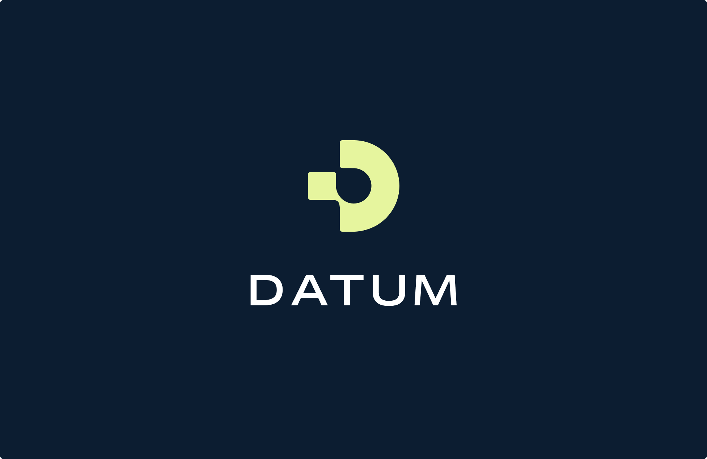
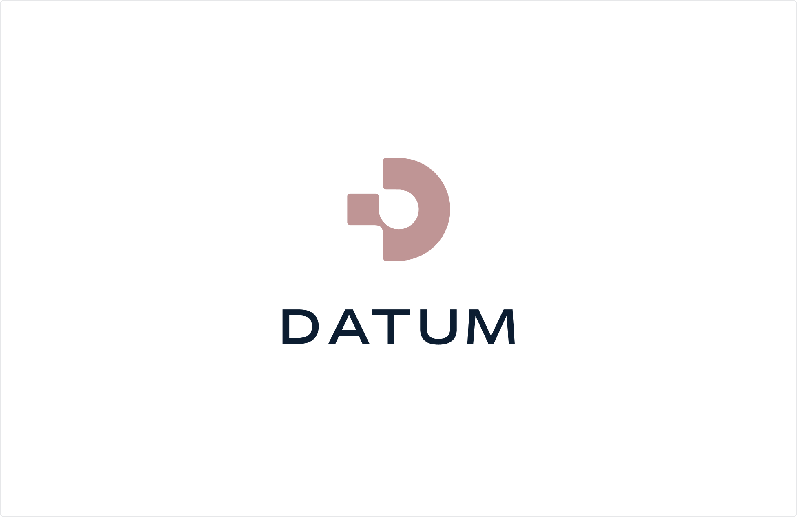
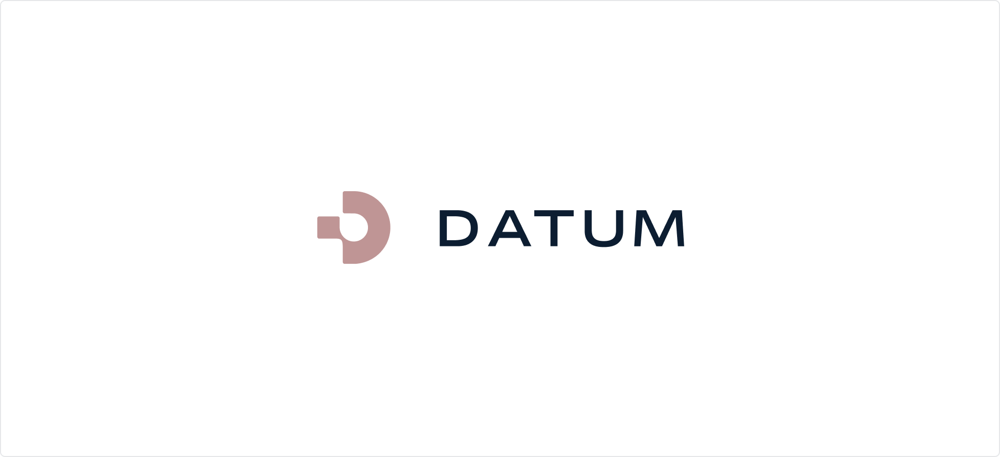

import Container from '@components/Container.astro';
import BrandCardImage from '@components/brand/BrandCardImage.astro';
import Button from '@components/Button.astro';

## Stacked Version

The Datum logo is our calling card, a tangible manifestation of everything we stand for. The logo stamp represents the concept of a datum being the start, a point of origin.

<Container tag="section" class="space-y-12 max-w-none lg:mt-16 md:mt-12 mt-8 lg:mb-30 md:mb-22 mb-16">

  

  

  <Button class="btn btn--cream btn--large" text="Download the logos" target="_blank" href="https://link.datum.net/logos" />

</Container>

## Horizontal Version

The Datum logo is our calling card, a tangible manifestation of everything we stand for. The logo stamp represents the concept of a datum being the start, a point of origin.

<Container tag="section" class="space-y-8 max-w-none lg:mt-16 md:mt-12 mt-8 lg:mb-30 md:mb-22 mb-16">

  

  

  <Button
  class="btn btn--cream btn--large"
  text="Download the logos"
  target="_blank"
  href="https://link.datum.net/logos"
  />

</Container>
