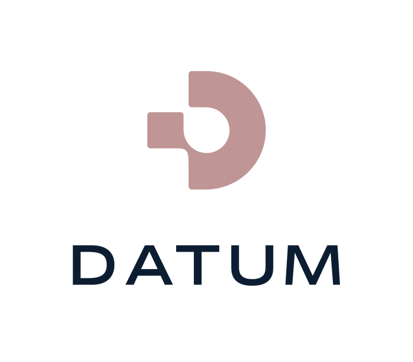
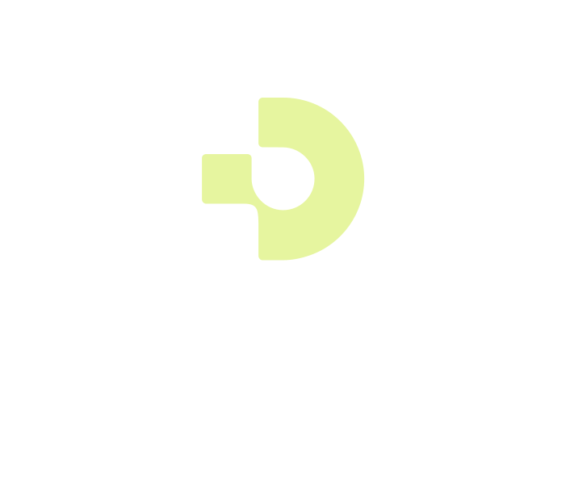
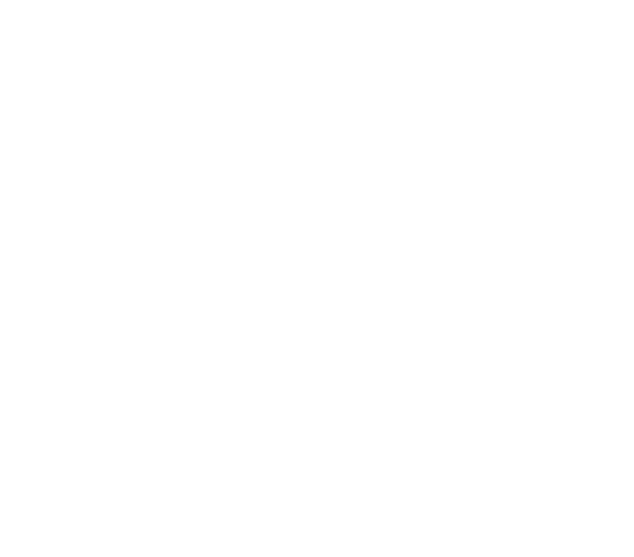
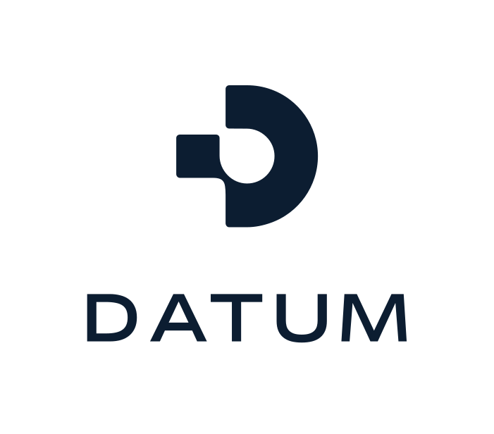
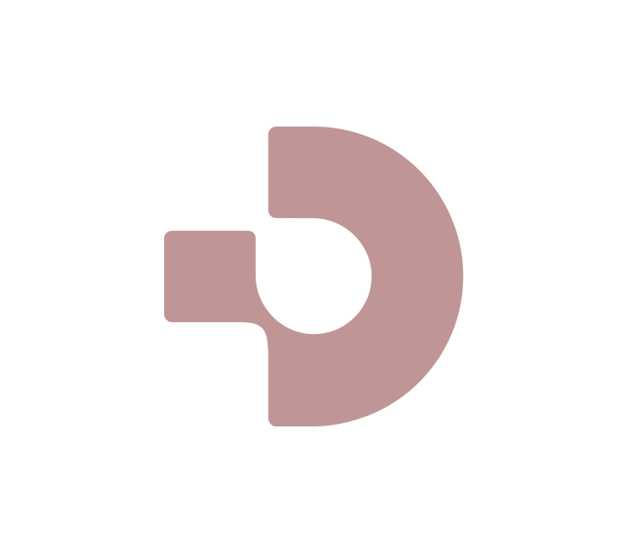
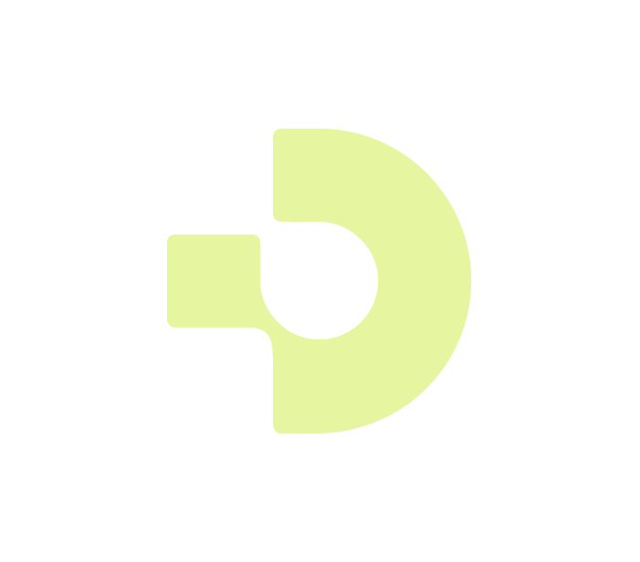

import Container from '@components/Container.astro';
import Button from '@components/Button.astro';

Our logo is the most recognizable expression of the Datum brand. Its stamp is built around the idea of a datum: a single point of data and the starting point for something larger. Combined with our wordmark, it creates a distinctive symbol of connected infrastructure.

## Stacked Version

The stacked logo is our most expressive configuration, placing the stamp above the Datum wordmark. Its balanced proportions work best in centered compositions and spaces with a square or vertical format.

Use one of the approved color combinations shown below, choosing the version that provides the clearest contrast against the background.

<Container tag="section" class="space-y-8 max-w-none lg:mb-24 md:mb-18 mb-12 brand-card-pad [&_img]:m-0!">

<Button class="btn btn--alpha" text="Download the logos" target="_blank" href="https://link.datum.net/logos" />

</Container>

## Flat Version

The flat logo places the stamp and wordmark side by side, creating a compact and versatile configuration. It is best suited to wider or shallower spaces, including website headers, navigation, documents, and presentation footers.

Use one of the approved color combinations shown below, ensuring the logo remains clear and legible at its intended size.

<Container tag="section" class="space-y-8 max-w-none mb-8 md:mb-12 brand-card-pad [&_img]:m-0!">

<Button
class="btn btn--alpha"
text="Download the logos"
target="_blank"
href="https://link.datum.net/logos"
/>

</Container>

## Stamp Only Version

The stamp can be used independently when the Datum brand is already established or when space is limited. Its simple, recognizable form makes it particularly effective for avatars, favicons, app icons, and small graphic details.

The stamp should not replace the complete logo when an audience may be unfamiliar with Datum. Use only the approved color combinations and maintain sufficient contrast against the background.

<Container tag="section" class="space-y-8 max-w-none brand-card-pad [&_img]:m-0!">

<Button
class="btn btn--alpha"
text="Download the logos"
target="_blank"
href="https://link.datum.net/logos"
/>

</Container>
