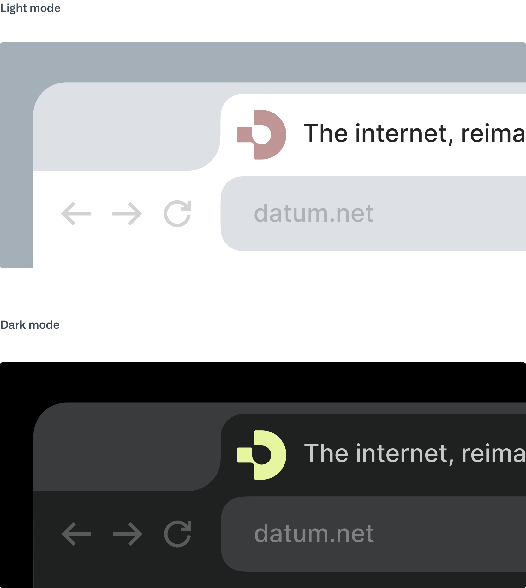
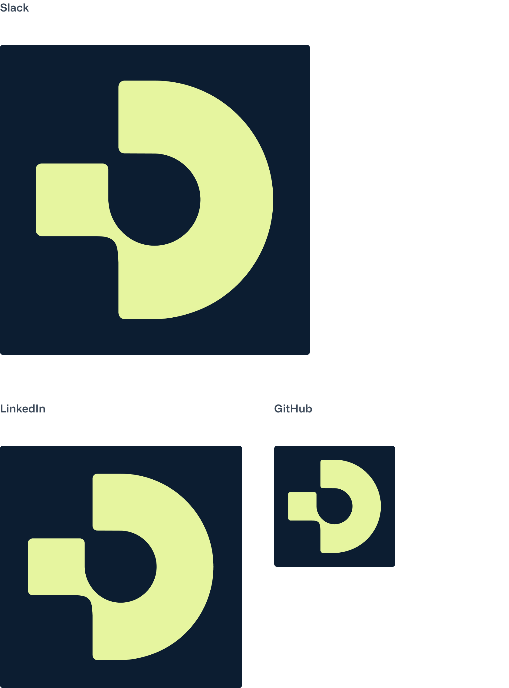
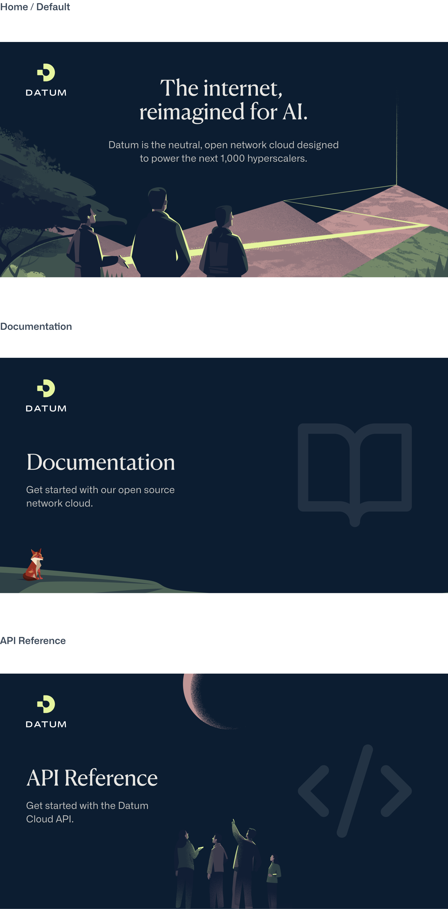
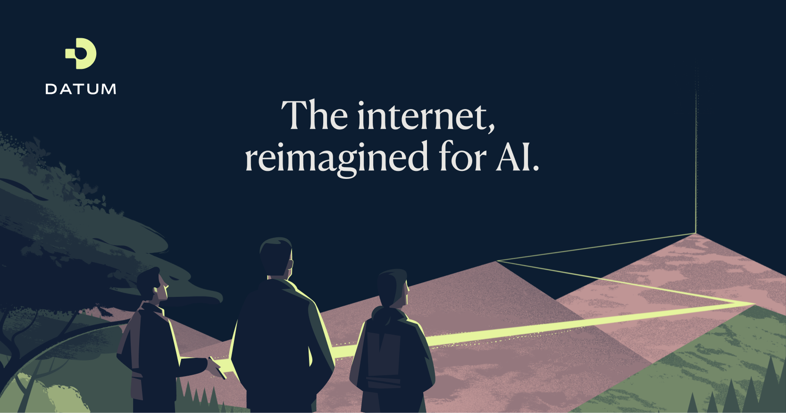

import Container from '@components/Container.astro';
import BrandCardImage from '@components/brand/BrandCardImage.astro';
import Button from '@components/Button.astro';

## Favicons

<Container tag="section" class="space-y-12 max-w-none lg:mt-16 md:mt-12 mt-8 mb-20">

<BrandCardImage>
  
</BrandCardImage>

<Button
  class="btn btn--cream btn--large"
  text="Download the favicons"
  target="_blank"
  href="https://drive.google.com/drive/folders/1-KlrhXQGBVD7pYnAjEuo5E-GFOVLYsBp?usp=drive_link"
  />

</Container>

## Social Icons

<Container tag="section" class="space-y-12 max-w-none lg:mt-16 md:mt-12 mt-8 mb-20">

<BrandCardImage>
  
</BrandCardImage>

<Button
  class="btn btn--cream btn--large"
  text="Download the icons"
  target="_blank"
  href="https://drive.google.com/drive/folders/1-KlrhXQGBVD7pYnAjEuo5E-GFOVLYsBp?usp=drive_link"
  />

</Container>

## Opengraph

<Container tag="section" class="space-y-12 max-w-none lg:mt-16 md:mt-12 mt-8 mb-20">

<BrandCardImage>
  
</BrandCardImage>

<Button
  class="btn btn--cream btn--large"
  text="Download the images"
  target="_blank"
  href="https://drive.google.com/drive/folders/1FN9eQccjuFHy3llhwwZlZjPFLoBb02O_?usp=drive_link"
  />

</Container>

## GitHub Imagery

<Container tag="section" class="space-y-12 max-w-none lg:mt-16 md:mt-12 mt-8 mb-20">

<BrandCardImage>
  
</BrandCardImage>

<Button
  class="btn btn--cream btn--large"
  text="Download the images"
  target="_blank"
  href="https://drive.google.com/drive/folders/1FN9eQccjuFHy3llhwwZlZjPFLoBb02O_?usp=drive_link"
  />

</Container>
