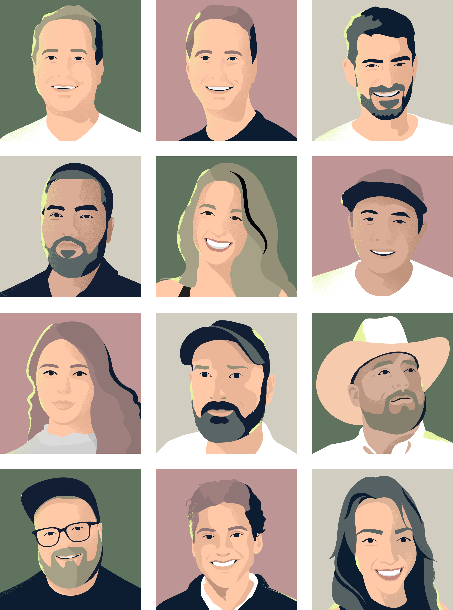
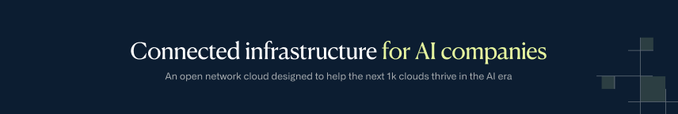
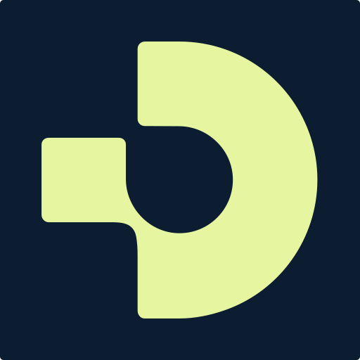
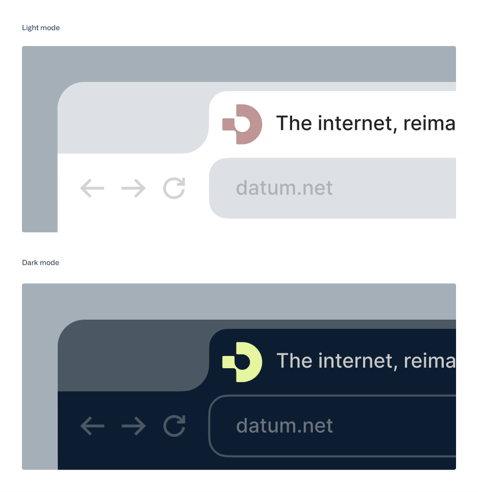

import Container from '@components/Container.astro';
import BrandCardImage from '@components/brand/BrandCardImage.astro';
import Button from '@components/Button.astro';

## Staff portraits

Our staff portraits bring personality and a more playful, human quality to the Datum brand. Their graphic style complements our wider illustration system, while giving every team member a distinctive but consistent visual treatment.

Each portrait is available in three approved colorways, providing flexibility across social content, presentations, and other brand communications.

<Container tag="section" class="space-y-8 max-w-none brand-card-pad mb-8 md:mb-12">
<BrandCardImage class="compact">

</BrandCardImage>

<Button
  class="btn btn--alpha"
  text="Download staff portraits"
  target="_blank"
  href="https://drive.google.com/drive/folders/1azAczACgnIYfjdsotS5lSn6OdntbSz6n?usp=sharing"
  />

</Container>

## LinkedIn Banner

Our LinkedIn banner creates a consistent and recognizable presence across company and employee profiles. It combines our core messaging, typography, and grid motif in a simple composition that reinforces the Datum brand without competing with profile content.

The banner is designed for use on both the Datum company page and individual team member profiles.

<Container tag="section" class="space-y-8 max-w-none brand-card-pad mb-8 md:mb-12">

<BrandCardImage class="compact">
  
</BrandCardImage>

<Button
  class="btn btn--alpha"
  text="Download the LinkedIn banner"
  target="_blank"
  href="https://drive.google.com/drive/folders/1azAczACgnIYfjdsotS5lSn6OdntbSz6n?usp=sharing"
  />

</Container>

## Social Icons

We use our stamp in isolation for Social media and app account purposes, or for any usage where there is additional context (e.g. company name).

<Container tag="section" class="space-y-12 max-w-none brand-card-pad mb-8 md:mb-12">

<BrandCardImage class="compact">

Slack

LinkedIn

GitHub

</BrandCardImage>

<Button
  class="btn btn--alpha"
  text="Download the icons"
  target="_blank"
  href="https://drive.google.com/drive/folders/1-KlrhXQGBVD7pYnAjEuo5E-GFOVLYsBp?usp=sharing"
  />

</Container>

## Favicons

Again a simple stamp is used for clarity, with the color treatment being swapped over for those users in dark mode.

<Container tag="section" class="space-y-12 max-w-none brand-card-pad">

<BrandCardImage class="compact">
  
</BrandCardImage>

<Button
  class="btn btn--alpha"
  text="Download the favicons"
  target="_blank"
  href="https://drive.google.com/drive/folders/1-KlrhXQGBVD7pYnAjEuo5E-GFOVLYsBp?usp=sharing"
  />

</Container>
