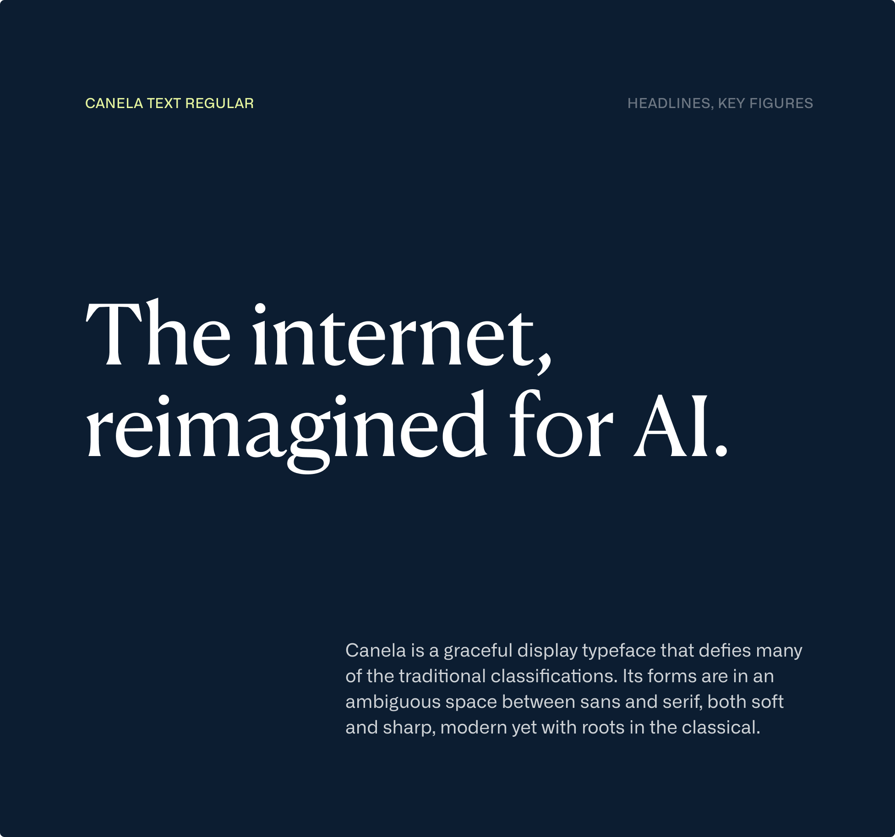
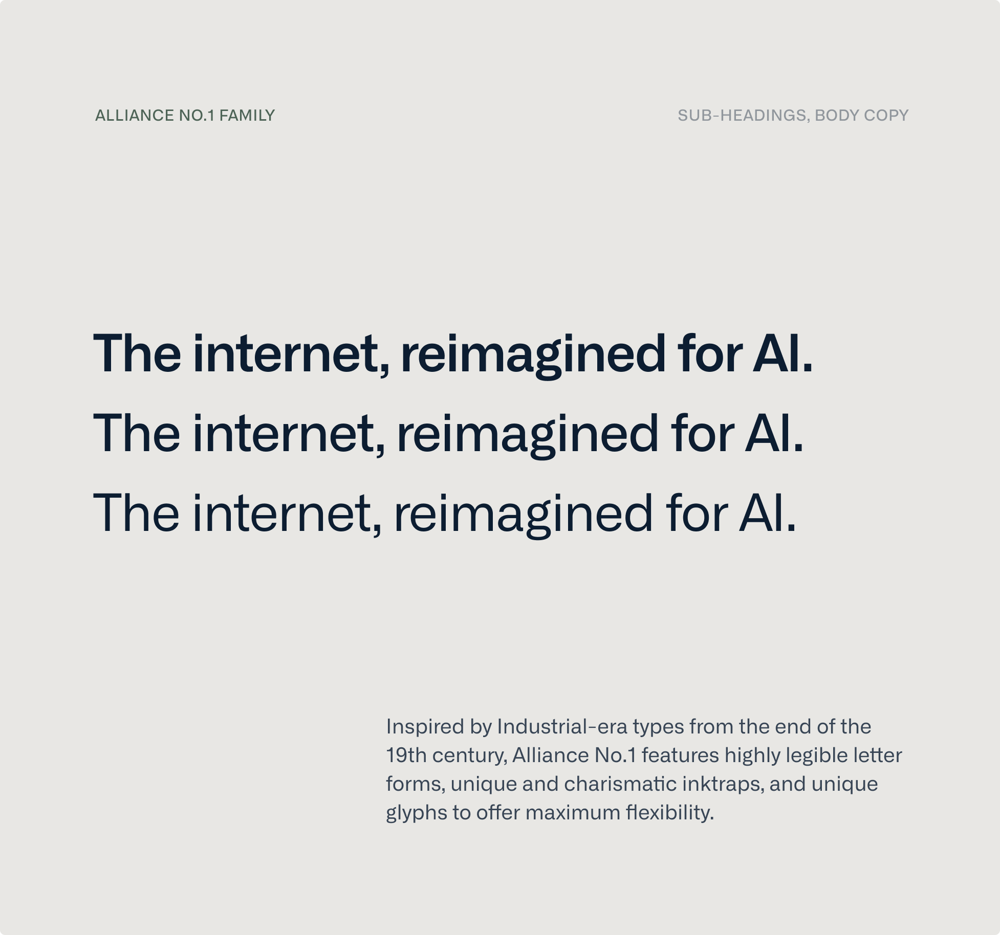

import Container from '@components/Container.astro';
import BrandCardImage from '@components/brand/BrandCardImage.astro';
import Button from '@components/Button.astro';

## Typefaces

Canela and Alliance No.1 are our brand typeface. They have been chosen to reflect our unique ethos, our principles, and to meet the needs of us as a global tech company.

<Container tag="section" class="space-y-12 max-w-none lg:mt-16 md:mt-12 mt-8 lg:mb-30 md:mb-22 mb-16">

  

  <Button
  class="btn btn--glacier-mist-700 btn--large"
  text="Download Canela"
  target="_blank"
  href="https://link.datum.net/fonts"
  />

  

  <Button
  class="btn btn--glacier-mist-700 btn--large"
  text="Download Alliance No.1"
  target="_blank"
  href="https://link.datum.net/fonts"
  />

</Container>

## Language Support

Our fonts support more than 100 languages, including extended Latin variants, to meet the diverse typographic needs of global communication. This comprehensive language coverage ensures effective and consistent typography across various international contexts.

<Container tag="section" class="space-y-12 max-w-none lg:mt-16 md:mt-12 mt-8 lg:mb-30 md:mb-22 mb-16 lg:columns-4 columns-3 text-base gap-x-7">
Abenaki\
Afar\
Afrikaans\
Albanian\
Alsatian\
Aragonese\
Aranese\
Arvanitic\
Asturian\
Atayal\
Aymara\
Azerbaijani\
Bashkir\
Basque\
Belarusian\
Bemba\
Bosnian\
Breton\
Cape Verdean\
Catalan\
Cebuano\
Chavacano\
Chichewa\
Chickasaw\
Cimbrian\
Cofan\
Cornish\
Corsican\
Creek\
Crimean Tatar\
Croatian\
Czech\
Danish\
Dawan\
Delaware\
Dholuo\
Drehu\
Dutch\
English\
Esperanto\
Estonian\
Faroese\
Fijian\
Filipino\
Finnish\
Folkspraak\
French\
Frisian\
Friulian\
Gagauz\
Galician\
Ganda\
Genoese\
German\
Gikuyu\
Gooniyandi\
Greenlandic\
Greenlandic Old Orthography\
Guadeloupean\
Gwichin\
Haitian Creole\
Han\
Hawaiian\
Hiligaynon\
Hopi\
Hotcak\
Hungarian\
Icelandic\
Ido\
Igbo\
Ilocano\
Indonesian\
Interglossa\
Interlingua\
Irish\
Istroromanian\
Italian\
Jamaican\
Javanese\
Jerriais\
Kaingang\
Kapampangan\
Kaqchikel\
Karakalpak\
Karelian\
Kashubian\
Kikongo\
Kinyarwanda\
Kiribati\
Kirundi\
Klingon\
Kurdish\
Ladin\
Latin\
Latino Sine\
Latvian\
Lithuanian\
Lojban\
Lombard\
Low Saxon\
Luxembourgish\
Maasai\
Makhuwa\
Malay\
Maltese\
Manx\
Maori\
Marquesan\
Meglenoromanian\
Mirandese\
Mohawk\
Moldovan\
Montagnais\
Montenegrin\
Murrinhpatha\
Nagamese Creole\
Nahuatl\
Ndebele\
Neapolitan\
Ngiyambaa\
Niuean\
Noongar\
Norwegian\
Novial\
Occidental\
Occitan\
Old Icelandic\
Old Norse\
Oshiwambo\
Ossetian\
Palauan\
Papiamento\
Piedmontese\
Polish\
Portuguese\
Potawatomi\
Qeqchi\
Quechua\
Rarotongan\
Romanian\
Romansh\
Rotokas\
Sami Inari\
Sami Lule\
Sami Northern\
Sami Southern\
Samoan\
Sango\
Saramaccan\
Sardinian\
Scottish Gaelic\
Serbian\
Seri\
Seychellois\
Shawnee\
Shona\
Sicilian\
Silesian\
Slovak\
Slovenian\
Slovio\
Somali\
Sorbian Lower\
Sorbian Upper\
Sotho Northern\
Sotho Southern\
Spanish\
Sranan\
Sundanese\
Swahili\
Swazi\
Swedish\
Tagalog\
Tahitian\
Tetum\
Tok Pisin\
Tokelauan\
Tongan\
Tshiluba\
Tsonga\
Tswana\
Tumbuka\
Turkish\
Turkmen\
Tuvaluan\
Tzotzil\
Ukrainian\
Uzbek\
Venetian\
Vepsian\
Volapuk\
Voro\
Wallisian\
Walloon\
Waraywaray\
Warlpiri\
Wayuu\
Welsh\
Wikmungkan\
Wiradjuri\
Wolof\
Xavante\
Xhosa\
Yapese\
Yindjibarndi\
Zapotec\
Zarma\
Zazaki\
Zulu\
Zuni
</Container>
